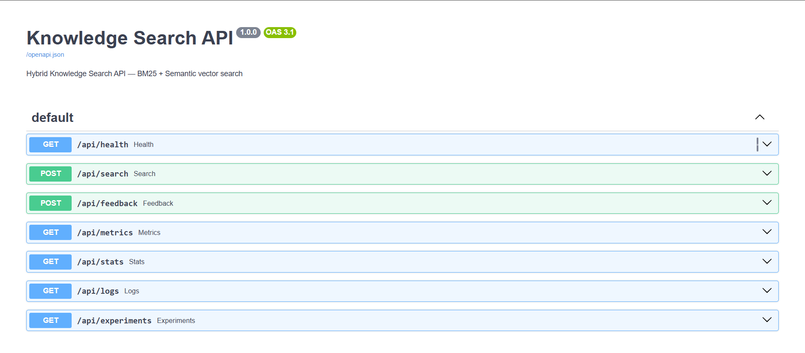
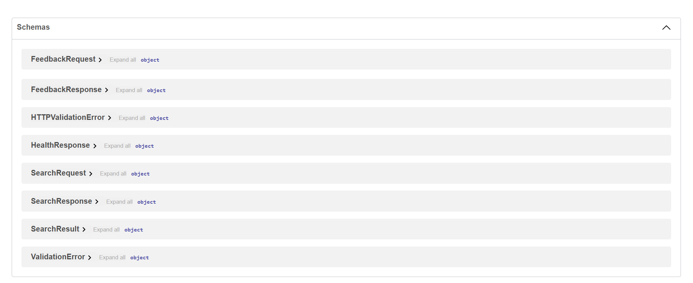

1. Clone / Open Project

Navigate to the project folder:

cd knowledge-search
2. Backend Setup

Go to backend folder:

cd backend

Create virtual environment (Python 3.12):

py -3.12 -m venv .venv

Activate virtual environment:

.\.venv\Scripts\Activate.ps1

Upgrade pip:

python -m pip install --upgrade pip

Install dependencies:

pip install -r requirements.txt

Install FAISS:

pip install faiss-cpu
3. Generate Document Corpus

Go back to project root:

cd ..

Generate dataset for search:

python scripts\generate_corpus.py
4. Start Backend Server

Go back to backend:

cd backend

Run API server:

uvicorn app.main:app --reload

Backend will run at:

http://127.0.0.1:8000

API docs:

http://127.0.0.1:8000/docs

